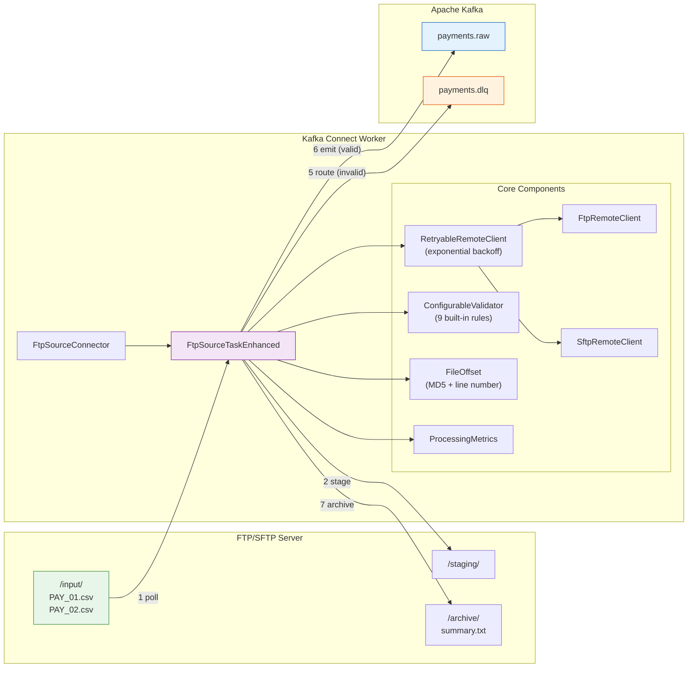
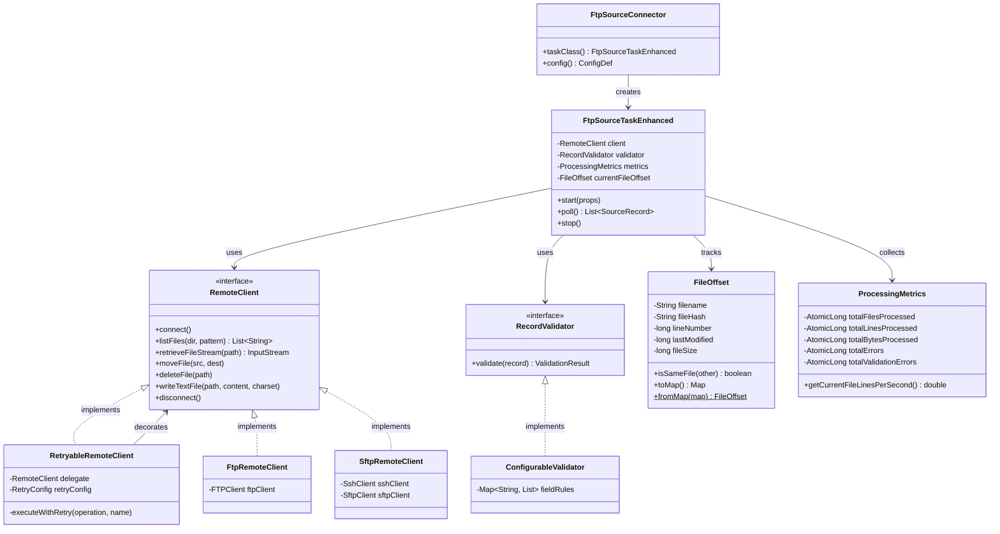
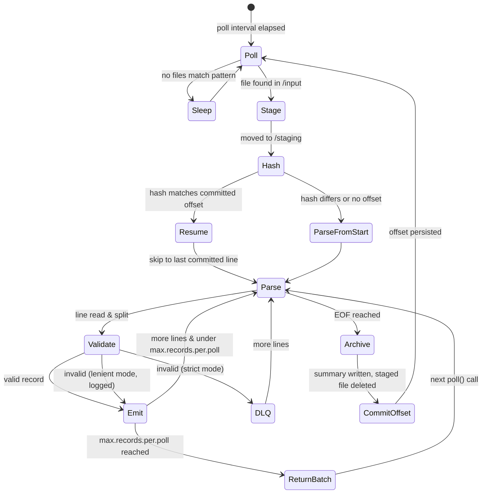

<!-- markdownlint-disable MD033 -->
<p align="center">
  <h1 align="center">FTP/SFTP Source Connector for Apache Kafka Connect</h1>
  <p align="center">
    Ingest delimited flat files from FTP and SFTP servers into Apache Kafka — reliably, resumably, and with zero custom code.
  </p>
</p>

<p align="center">
  <a href="https://www.apache.org/licenses/LICENSE-2.0"></a>
  <a href="https://github.com/dougdalo/ftp-source-connector/releases"></a>
  
  
</p>

---

## Table of Contents

- [Why This Exists](#why-this-exists)
- [Architecture](#architecture)
- [Features](#features)
- [Quick Start](#quick-start)
- [Configuration Reference](#configuration-reference)
- [Output Formats](#output-formats)
- [Production Deployment](#production-deployment)
- [Observability and Troubleshooting](#observability-and-troubleshooting)
- [Performance Tuning](#performance-tuning)
- [How It Works Internally](#how-it-works-internally)
- [Use Cases](#use-cases)
- [Limitations and Trade-offs](#limitations-and-trade-offs)
- [Roadmap](#roadmap)
- [Running Tests](#running-tests)
- [Contributing](#contributing)
- [License](#license)

---

## Why This Exists

Many organizations still rely on batch-file exchanges over FTP/SFTP — banks, ERPs, logistics providers, and government agencies routinely drop `.csv` or `.txt` files on remote servers. Getting that data into Kafka typically means writing fragile cron-based scripts, managing offsets manually, and handling retries in ad-hoc ways.

This connector eliminates that glue code. It plugs directly into the Kafka Connect framework, providing a declarative, fault-tolerant pipeline from FTP/SFTP flat files to Kafka topics — with built-in offset tracking, field validation, dead-letter queues, and automatic retries.

**Before this connector:**
```
cron job → bash script → FTP download → parse CSV → kafka-console-producer → pray
```

**After:**
```json
{
  "connector.class": "br.com.datastreambrasil.kafka.connector.ftp.FtpSourceConnector",
  "ftp.host": "sftp.payments.internal",
  "topic": "payments.raw"
}
```

One JSON config. No scripts. Offset tracking, retries, validation, and DLQ included.

---

## Architecture

### High-Level Data Flow



### Internal Class Structure



### Processing Lifecycle (per file)



### Processing Pipeline

| Step | Action | Detail |
|------|--------|--------|
| 1 | **Poll** | Scan the input directory at a configurable interval for files matching the regex pattern |
| 2 | **Stage** | Atomically move the file to a staging directory — prevents double-processing by other tasks or external systems |
| 3 | **Hash** | Compute an MD5 hash of the file content; compare against the committed offset to decide whether to resume or reprocess |
| 4 | **Parse** | Read line-by-line, split by delimiter, map to named fields with a Kafka Connect `Struct` schema |
| 5 | **Validate** | Apply field-level rules (optional); route invalid records to a dead-letter topic or skip them |
| 6 | **Emit** | Publish valid `SourceRecord` objects to the target Kafka topic with composite keys |
| 7 | **Archive** | Delete the staged file, write a summary report (lines, errors, throughput) to the archive directory |
| 8 | **Commit** | Kafka Connect commits the offset (file hash + line number) — enabling exact resume on restart |

---

## Features

| Category | Capabilities |
|----------|-------------|
| **Protocols** | FTP (passive mode, Apache Commons Net) and SFTP (Apache MINA SSHD) via pluggable `RemoteClient` interface |
| **Output Formats** | Raw string pass-through or structured JSON with Kafka Connect schemas — compatible with JDBC Sink, Elasticsearch Sink, etc. |
| **Offset Tracking** | MD5 hash + line number stored in Kafka Connect offset storage; detects file changes and resumes from the exact line |
| **Retry** | Exponential backoff with configurable max attempts and ceiling — wraps all remote operations (connect, list, read, move, delete) |
| **Validation** | 9 built-in rules: `not_empty`, `numeric`, `integer`, `email`, `date(pattern)`, `length_min(n)`, `length_max(n)`, `range(min,max)`, `pattern(regex)` |
| **Dead Letter Queue** | Route invalid or failed records to a separate topic with full error context (original line, error type, source file, line number, timestamp) |
| **Compression** | Automatic GZIP detection and decompression based on `.gz`/`.gzip` extension |
| **File Filtering** | Regex-based filename matching, configurable header/footer line skipping, comment line filtering, empty line handling |
| **Key Composition** | Single or composite Kafka keys from parsed fields (`type+code` produces `WB_284`) |
| **Metrics** | Per-file and cumulative counters: files processed, lines, bytes, errors, validation failures, throughput (lines/sec) — logged at configurable intervals |
| **Backward Compatible** | v2.0 is a drop-in replacement for v1.0 configurations — the `FtpSourceConnector` class delegates to the enhanced implementation internally |

---

## Quick Start

### Prerequisites

- Java 11+
- Apache Kafka with Kafka Connect (tested with Kafka 3.x)
- Maven 3.6+ (for building from source)

### 1. Build

```bash
git clone https://github.com/dougdalo/ftp-source-connector.git
cd ftp-source-connector
mvn clean package
```

The build produces `target/ftp-source-connector-1.1.3-jar-with-dependencies.jar`.

### 2. Deploy

Copy the JAR to your Kafka Connect plugin path:

```bash
# Create the plugin directory if it doesn't exist
mkdir -p /usr/share/java/kafka-connect-ftp/

# Deploy the connector JAR
cp target/ftp-source-connector-*-jar-with-dependencies.jar \
   /usr/share/java/kafka-connect-ftp/
```

Ensure the path is listed in your Connect worker's `plugin.path`:

```properties
# connect-distributed.properties
plugin.path=/usr/share/java
```

Restart the Kafka Connect worker to pick up the new plugin.

### 3. Verify Plugin Registration

```bash
# List installed connector plugins
curl -s http://localhost:8083/connector-plugins | jq '.[].class' | grep -i ftp
# Expected: "br.com.datastreambrasil.kafka.connector.ftp.FtpSourceConnector"
```

### 4. Create the Connector

**Minimal configuration** — start here to validate connectivity:

```bash
curl -X POST http://localhost:8083/connectors \
  -H "Content-Type: application/json" \
  -d '{
    "name": "ftp-source",
    "config": {
      "connector.class": "br.com.datastreambrasil.kafka.connector.ftp.FtpSourceConnector",
      "ftp.protocol": "sftp",
      "ftp.host": "ftp.example.com",
      "ftp.port": "22",
      "ftp.username": "svc-kafka",
      "ftp.password": "secret",
      "ftp.directory": "/input",
      "ftp.directory.stage": "/staging",
      "ftp.directory.archive": "/archive",
      "topic": "ftp-data",
      "tasks.max": "1"
    }
  }'
```

**With JSON parsing, validation, and DLQ** — typical production setup:

```bash
curl -X POST http://localhost:8083/connectors \
  -H "Content-Type: application/json" \
  -d '{
    "name": "ftp-source-json",
    "config": {
      "connector.class": "br.com.datastreambrasil.kafka.connector.ftp.FtpSourceConnector",
      "ftp.protocol": "sftp",
      "ftp.host": "ftp.example.com",
      "ftp.port": "22",
      "ftp.username": "svc-kafka",
      "ftp.password": "secret",
      "ftp.directory": "/input",
      "ftp.directory.stage": "/staging",
      "ftp.directory.archive": "/archive",
      "ftp.file.pattern": ".*\\.csv",
      "ftp.file.output.format": "json",
      "ftp.file.tokenizer": ";",
      "ftp.file.headers": "type,date,time,code,value",
      "ftp.file.skip.header.lines": "1",
      "ftp.kafka.key.field": "type+code",
      "ftp.validation.enabled": "true",
      "ftp.validation.mode": "strict",
      "ftp.validation.rules": "type:not_empty,code:not_empty,value:numeric",
      "ftp.dlq.enabled": "true",
      "ftp.dlq.topic": "ftp-data.dlq",
      "ftp.retry.max.attempts": "5",
      "topic": "ftp-data",
      "tasks.max": "1"
    }
  }'
```

### 5. Verify

```bash
# Check connector status
curl -s http://localhost:8083/connectors/ftp-source/status | jq .

# Expected response:
# {
#   "name": "ftp-source",
#   "connector": { "state": "RUNNING", "worker_id": "connect-1:8083" },
#   "tasks": [{ "id": 0, "state": "RUNNING", "worker_id": "connect-1:8083" }]
# }

# Consume records from the topic
kafka-console-consumer --bootstrap-server localhost:9092 \
  --topic ftp-data --from-beginning --max-messages 5
```

### 6. Manage

```bash
# Pause the connector
curl -X PUT http://localhost:8083/connectors/ftp-source/pause

# Resume the connector
curl -X PUT http://localhost:8083/connectors/ftp-source/resume

# Restart a failed task
curl -X POST http://localhost:8083/connectors/ftp-source/tasks/0/restart

# Update configuration (PUT replaces the entire config)
curl -X PUT http://localhost:8083/connectors/ftp-source/config \
  -H "Content-Type: application/json" \
  -d @updated-config.json

# Delete the connector
curl -X DELETE http://localhost:8083/connectors/ftp-source
```

---

## Configuration Reference

### Connection

| Property | Required | Default | Description |
|----------|----------|---------|-------------|
| `ftp.protocol` | Yes | — | `ftp` or `sftp` |
| `ftp.host` | Yes | — | Server hostname or IP |
| `ftp.port` | No | 21 / 22 | Port (auto-selected by protocol) |
| `ftp.username` | Yes | — | Authentication username |
| `ftp.password` | Yes | — | Authentication password (supports [externalized secrets](#externalized-secrets)) |

### Directories

| Property | Required | Default | Description |
|----------|----------|---------|-------------|
| `ftp.directory` | Yes | — | Input directory to poll for new files |
| `ftp.directory.stage` | Yes | — | Staging directory (files move here during processing) |
| `ftp.directory.archive` | Yes | — | Archive directory (processed files and summary reports) |

> **Important:** The FTP/SFTP user must have read, write, and delete permissions on all three directories. Use separate directory trees to avoid conflicts with other processes.

### File Processing

| Property | Default | Description |
|----------|---------|-------------|
| `ftp.file.pattern` | `.*\.txt` | Regex to match filenames in the input directory |
| `ftp.file.encoding` | `UTF-8` | Character encoding of source files |
| `ftp.file.output.format` | `string` | `string` (raw lines) or `json` (structured with schema) |
| `ftp.file.tokenizer` | `;` | Delimiter for splitting lines in JSON mode |
| `ftp.file.headers` | *(empty)* | Comma-separated field names for JSON output |
| `ftp.file.skip.header.lines` | `0` | Number of header lines to skip at the top of each file |
| `ftp.file.skip.footer.lines` | `0` | Number of footer lines to skip at the bottom of each file |
| `ftp.file.empty.lines.skip` | `true` | Skip blank lines |
| `ftp.file.comment.prefix` | *(empty)* | Skip lines starting with this prefix (e.g., `#`) |
| `ftp.file.compression.auto.detect` | `true` | Automatically decompress `.gz`/`.gzip` files |

### Kafka

| Property | Required | Default | Description |
|----------|----------|---------|-------------|
| `topic` | Yes | — | Target Kafka topic |
| `ftp.kafka.key.field` | No | *(empty)* | Field(s) for message key; use `+` for composite (e.g., `type+code`) |

### Performance

| Property | Default | Description |
|----------|---------|-------------|
| `ftp.poll.interval.ms` | `10000` | How often to check for new files (milliseconds) |
| `ftp.max.records.per.poll` | `1000` | Max records returned per `poll()` call |
| `ftp.buffer.size.bytes` | `32768` | Read buffer size for file streaming |

### Retry

| Property | Default | Description |
|----------|---------|-------------|
| `ftp.retry.max.attempts` | `3` | Max retry attempts on transient FTP/SFTP failures |
| `ftp.retry.backoff.ms` | `1000` | Initial backoff in milliseconds |
| `ftp.retry.max.backoff.ms` | `30000` | Maximum backoff ceiling; backoff doubles each attempt |

### Validation

Field-level validation in JSON output mode. Invalid records are either skipped (`strict`) or passed through with a warning (`lenient`).

| Property | Default | Description |
|----------|---------|-------------|
| `ftp.validation.enabled` | `false` | Enable field-level validation |
| `ftp.validation.mode` | `strict` | `strict` = skip invalid records, `lenient` = log warning and pass through |
| `ftp.validation.rules` | *(empty)* | Rule definitions (see syntax below) |

**Rule syntax:** `field1:rule1,field2:rule2,...`

| Rule | Example | Description |
|------|---------|-------------|
| `not_empty` | `code:not_empty` | Field must not be blank |
| `numeric` | `amount:numeric` | Must be a number (integer or decimal) |
| `integer` | `quantity:integer` | Must be a whole number |
| `email` | `contact:email` | Must match email format |
| `date(pattern)` | `created:date(yyyy-MM-dd)` | Must match the given date pattern |
| `length_min(n)` | `name:length_min(3)` | Minimum string length |
| `length_max(n)` | `currency:length_max(3)` | Maximum string length |
| `range(min,max)` | `age:range(0,150)` | Numeric value must be within range (inclusive) |
| `pattern(regex)` | `account:pattern(\\d{10})` | Must match the given regex |

Multiple rules per field are supported:

```properties
ftp.validation.rules=tx_id:not_empty,amount:numeric,amount:range(0.01,1000000),currency:length_max(3)
```

### Dead Letter Queue

| Property | Default | Description |
|----------|---------|-------------|
| `ftp.dlq.enabled` | `false` | Enable DLQ routing for invalid/failed records |
| `ftp.dlq.topic` | `<topic>.dlq` | DLQ topic name |

DLQ records are emitted as structured Kafka Connect `Struct` with the following fields:

| Field | Type | Description |
|-------|------|-------------|
| `original_line` | string | The raw line that failed |
| `error_type` | string | `VALIDATION_ERROR` or `PROCESSING_ERROR` |
| `error_message` | string | Human-readable error description |
| `source_file` | string | Name of the source file |
| `line_number` | long | Line number in the source file |
| `timestamp` | string | ISO-8601 timestamp of the error |

### Metrics

| Property | Default | Description |
|----------|---------|-------------|
| `ftp.metrics.interval.lines` | `10000` | Log processing metrics every N lines |

---

## Output Formats

### String Mode (default)

Each line is emitted as a raw string with `Schema.STRING_SCHEMA`. No parsing, no field mapping.

```properties
ftp.file.output.format=string
```

Best for: log ingestion, raw archival, or when downstream consumers handle parsing.

### JSON Mode

Lines are split by the delimiter and mapped to named fields. The connector produces a Kafka Connect `Struct` with a schema, enabling downstream connectors (JDBC Sink, Elasticsearch Sink, S3 Sink, etc.) to use the schema directly for automatic table creation, index mapping, or partitioned writes.

Given `ftp.file.headers=type,date,time,code,value` and this input line:

```
WB;20250217;1754;284;255
```

The connector produces:

```json
{
  "schema": {
    "type": "struct",
    "fields": [
      { "field": "type", "type": "string" },
      { "field": "date", "type": "string" },
      { "field": "time", "type": "string" },
      { "field": "code", "type": "string" },
      { "field": "value", "type": "string" }
    ]
  },
  "payload": {
    "type": "WB",
    "date": "20250217",
    "time": "1754",
    "code": "284",
    "value": "255"
  }
}
```

If a line has more columns than configured headers, extra fields are auto-named `field6`, `field7`, etc.

### Key Composition

Set `ftp.kafka.key.field` to control record keys. Use `+` for composite keys:

| Config | Input Line | Resulting Key |
|--------|-----------|---------------|
| `code` | `WB;20250217;1754;284;255` | `284` |
| `type+code` | `WB;20250217;1754;284;255` | `WB_284` |
| *(empty)* | any | `null` (round-robin partitioning) |

Missing fields are silently omitted from the key.

---

## Production Deployment

### Externalized Secrets

Never put passwords in plain text in connector configs. Use Kafka Connect's `ConfigProvider` to reference external secret stores:

```json
{
  "ftp.password": "${file:/opt/kafka-connect/secrets.properties:sftp.password}"
}
```

The `FileConfigProvider` ships with Kafka Connect. Enable it in your worker config:

```properties
# connect-distributed.properties
config.providers=file
config.providers.file.class=org.apache.kafka.common.config.provider.FileConfigProvider
```

### Production Configuration Example

A realistic config for ingesting semicolon-delimited payment files over SFTP with validation, DLQ, and tuned retry:

```json
{
  "name": "payments-ingest",
  "config": {
    "connector.class": "br.com.datastreambrasil.kafka.connector.ftp.FtpSourceConnector",

    "ftp.protocol": "sftp",
    "ftp.host": "sftp.payments.internal",
    "ftp.port": "22",
    "ftp.username": "svc-kafka-connect",
    "ftp.password": "${file:/opt/kafka-connect/secrets.properties:sftp.password}",

    "ftp.directory": "/drop/payments",
    "ftp.directory.stage": "/processing/payments",
    "ftp.directory.archive": "/archive/payments",
    "ftp.file.pattern": "PAY_.*\\.csv",
    "ftp.file.encoding": "UTF-8",
    "ftp.file.skip.header.lines": "1",

    "ftp.file.output.format": "json",
    "ftp.file.tokenizer": ";",
    "ftp.file.headers": "tx_id,amount,currency,account,timestamp",
    "ftp.kafka.key.field": "tx_id",

    "ftp.poll.interval.ms": "30000",
    "ftp.max.records.per.poll": "5000",
    "ftp.buffer.size.bytes": "65536",

    "ftp.retry.max.attempts": "5",
    "ftp.retry.backoff.ms": "2000",
    "ftp.retry.max.backoff.ms": "60000",

    "ftp.validation.enabled": "true",
    "ftp.validation.mode": "strict",
    "ftp.validation.rules": "tx_id:not_empty,amount:numeric,currency:length_max(3)",

    "ftp.dlq.enabled": "true",
    "ftp.dlq.topic": "payments.dlq",

    "ftp.metrics.interval.lines": "50000",

    "topic": "payments.raw",
    "tasks.max": "1"
  }
}
```

### Pre-Deployment Checklist

Before deploying to production, verify:

- [ ] **FTP/SFTP connectivity** — `sftp user@host` or `ftp host` works from the Connect worker
- [ ] **Directory permissions** — the service account can list, read, move, and delete in all three directories
- [ ] **Target topic exists** — pre-create with the desired partition count and replication factor
- [ ] **DLQ topic exists** (if enabled) — auto-creation may not be enabled in production clusters
- [ ] **Secrets externalized** — passwords are not in plaintext in the connector config
- [ ] **Retry tuned** — set `ftp.retry.max.attempts` >= 3 for unreliable networks
- [ ] **Validation rules tested** — run with `lenient` mode first to see what would be rejected, then switch to `strict`
- [ ] **Monitoring in place** — log aggregation and alerting on `ERROR` log lines from the connector

### Downstream Integration Examples

The connector's schema-aware JSON output integrates directly with Kafka Connect sink connectors:

**JDBC Sink (auto-create table from schema):**
```json
{
  "name": "payments-jdbc-sink",
  "config": {
    "connector.class": "io.confluent.connect.jdbc.JdbcSinkConnector",
    "connection.url": "jdbc:postgresql://db:5432/warehouse",
    "topics": "payments.raw",
    "auto.create": "true",
    "insert.mode": "upsert",
    "pk.mode": "record_value",
    "pk.fields": "tx_id"
  }
}
```

**Elasticsearch Sink (auto-create index):**
```json
{
  "name": "payments-es-sink",
  "config": {
    "connector.class": "io.confluent.connect.elasticsearch.ElasticsearchSinkConnector",
    "connection.url": "http://elasticsearch:9200",
    "topics": "payments.raw",
    "type.name": "_doc",
    "key.ignore": "false",
    "schema.ignore": "false"
  }
}
```

**S3 Sink (partitioned Parquet files):**
```json
{
  "name": "payments-s3-sink",
  "config": {
    "connector.class": "io.confluent.connect.s3.S3SinkConnector",
    "s3.bucket.name": "data-lake-raw",
    "topics": "payments.raw",
    "format.class": "io.confluent.connect.s3.format.parquet.ParquetFormat",
    "flush.size": "10000",
    "partitioner.class": "io.confluent.connect.storage.partitioner.DailyPartitioner"
  }
}
```

---

## Observability and Troubleshooting

### Log Output

The connector emits structured log messages at key points in the processing pipeline. All logs are namespaced under `br.com.datastreambrasil.kafka.connector.ftp`.

**Key log events to watch for:**

| Log Level | Message Pattern | Meaning |
|-----------|----------------|---------|
| `INFO` | `Polling files from directory: /input` | Poll cycle started |
| `INFO` | `Polled N files from directory: /input in X ms` | Files discovered |
| `INFO` | `Staging file: /input/PAY.csv -> /staging/PAY.csv` | File moved to staging |
| `INFO` | `Resuming file PAY.csv from line 5000` | Offset resume triggered |
| `INFO` | `Processed N lines (skipped M) from PAY.csv in X ms` | Periodic progress (every `ftp.metrics.interval.lines`) |
| `INFO` | `Finished processing file PAY.csv with N lines` | File completed |
| `INFO` | `Final metrics: ProcessingMetrics{...}` | Connector stopping, cumulative stats |
| `WARN` | `Validation failed for line N: ...` | Record failed validation |
| `WARN` | `Operation 'X' failed (attempt N/M), retrying in Xms` | Transient failure, retrying |
| `ERROR` | `Operation 'X' failed after N attempt(s)` | All retries exhausted |
| `ERROR` | `Error during polling` | Unrecoverable error in the poll loop |

### Enable Debug Logging

Add to your Connect worker's `log4j.properties`:

```properties
log4j.logger.br.com.datastreambrasil.kafka.connector.ftp=DEBUG
```

This exposes per-record processing detail, DLQ routing decisions, and schema caching behavior.

### Built-in Metrics

The connector tracks the following metrics internally via `ProcessingMetrics` (thread-safe, `AtomicLong`-backed):

| Metric | Scope | Description |
|--------|-------|-------------|
| `totalFilesProcessed` | Cumulative | Files fully processed since connector start |
| `totalLinesProcessed` | Cumulative | Lines successfully emitted |
| `totalBytesProcessed` | Cumulative | Bytes read from source files |
| `totalErrors` | Cumulative | Processing errors (parse failures, I/O errors) |
| `totalValidationErrors` | Cumulative | Records that failed field-level validation |
| `currentFileLinesPerSecond` | Per-file | Throughput of the file being processed |
| `currentFileDurationMs` | Per-file | Elapsed time for the current file |

These are logged at the interval set by `ftp.metrics.interval.lines` and as a summary when each file completes.

### Summary Reports

After each file is fully processed, the connector writes a summary report to the archive directory:

```
File: PAY_20250217.csv
Lines processed: 48230
Lines skipped: 12
Processed at: 20250217_143022481
Processing time (ms): 9640
Average line read time (ms): 0
Max line read time (ms): 3
Validation errors: 7
Processing errors: 0
Lines per second: 5003.11
```

These reports serve as an audit trail and can be consumed by monitoring systems that watch the archive directory.

### Health Check Commands

Use these commands to diagnose issues in a running deployment:

```bash
# 1. Is the connector running?
curl -s http://localhost:8083/connectors/ftp-source/status | jq '.connector.state'
# Expected: "RUNNING"

# 2. Is the task running?
curl -s http://localhost:8083/connectors/ftp-source/status | jq '.tasks[0].state'
# Expected: "RUNNING"
# If "FAILED", check: jq '.tasks[0].trace'

# 3. Check for errors in logs
grep -i "error\|exception\|failed" /var/log/kafka-connect/connect.log | tail -20

# 4. Are files being processed?
grep "Finished processing file" /var/log/kafka-connect/connect.log | tail -5

# 5. Are files stuck in staging?
# (via FTP/SFTP — files should not linger here)
sftp svc-kafka@sftp.host -c "ls /staging/"

# 6. Is the DLQ growing unexpectedly?
kafka-consumer-groups --bootstrap-server localhost:9092 \
  --describe --group connect-ftp-source 2>/dev/null
```

### Common Issues

<details>
<summary><strong>Connector is RUNNING but no records appear</strong></summary>

1. Verify files exist in the input directory and match `ftp.file.pattern`:
   ```bash
   sftp svc-kafka@host -c "ls /input/"
   ```
2. Check the connector logs for `Polled 0 files` — the regex may not match.
3. Ensure the FTP user has read permission on the input directory.

</details>

<details>
<summary><strong>Files are reprocessed after restart</strong></summary>

This is expected if:
- The file content changed (hash mismatch detected — you'll see `File X has changed, processing from start`).
- This is the first restart after upgrading from v1.0 (no v2.0 offsets exist yet).

If neither applies, check that `offset.flush.interval.ms` in the Connect worker config is not set too high.

</details>

<details>
<summary><strong>OutOfMemoryError on large files</strong></summary>

The connector reads the entire file into memory to compute the MD5 hash. For very large files:
1. Reduce `ftp.max.records.per.poll` to `500` to limit in-flight records.
2. Increase Connect worker heap: `KAFKA_HEAP_OPTS="-Xms1G -Xmx4G"`.
3. Reduce `ftp.buffer.size.bytes` if memory is tight.

</details>

<details>
<summary><strong>Connection timeouts / network errors</strong></summary>

```
ERROR Operation 'connect' failed after 3 attempts
```

1. Test connectivity from the Connect worker: `nc -zv host 22`.
2. Increase retry: `ftp.retry.max.attempts=5`, `ftp.retry.max.backoff.ms=60000`.
3. For FTP (not SFTP), passive mode is enabled by default. Ensure the firewall allows ephemeral port ranges (49152-65534).

</details>

<details>
<summary><strong>File stuck in staging directory</strong></summary>

A file in staging means it was being processed when the connector stopped. On restart:
1. The connector will poll the input directory for new files — it does not re-scan staging.
2. Manually move the file back to the input directory, or delete it from staging if it has already been processed.
3. Restart the connector: `curl -X POST http://localhost:8083/connectors/ftp-source/restart`.

</details>

<details>
<summary><strong>DLQ topic not found</strong></summary>

If `auto.create.topics.enable=false` on your broker (common in production), pre-create the DLQ topic:

```bash
kafka-topics --create \
  --topic payments.dlq \
  --partitions 3 \
  --replication-factor 3 \
  --bootstrap-server localhost:9092
```

</details>

For more diagnostic procedures, see [TROUBLESHOOTING.md](TROUBLESHOOTING.md).

---

## Performance Tuning

### Key Tuning Parameters

| Parameter | Effect | Trade-off |
|-----------|--------|-----------|
| `ftp.max.records.per.poll` | Controls how many records are returned per `poll()` call | Higher = better throughput, more memory pressure |
| `ftp.buffer.size.bytes` | Read buffer for file streaming | Higher = fewer I/O syscalls, more memory per file |
| `ftp.poll.interval.ms` | Delay between poll cycles when no files are found | Lower = faster pickup, more FTP connections |
| `ftp.metrics.interval.lines` | How often to log progress metrics | Lower = more log volume, better visibility |
| `ftp.validation.enabled` | Enable/disable field-level validation | Validation adds per-record overhead |
| `ftp.file.output.format` | `string` vs `json` | String mode skips parsing and schema creation entirely |

### Recommended Profiles

**High-throughput (large files, simple data):**
```json
{
  "ftp.max.records.per.poll": "10000",
  "ftp.buffer.size.bytes": "131072",
  "ftp.poll.interval.ms": "5000",
  "ftp.file.output.format": "string",
  "ftp.validation.enabled": "false",
  "ftp.metrics.interval.lines": "100000"
}
```

**Balanced (medium files, structured data with validation):**
```json
{
  "ftp.max.records.per.poll": "5000",
  "ftp.buffer.size.bytes": "65536",
  "ftp.poll.interval.ms": "10000",
  "ftp.file.output.format": "json",
  "ftp.validation.enabled": "true",
  "ftp.metrics.interval.lines": "50000"
}
```

**Memory-conservative (large files, constrained heap):**
```json
{
  "ftp.max.records.per.poll": "500",
  "ftp.buffer.size.bytes": "8192",
  "ftp.poll.interval.ms": "30000",
  "ftp.metrics.interval.lines": "10000"
}
```

### Expected Throughput

Measured on a single task with SFTP over a local network, JSON mode with 5-field records:

| File Size | Lines | Approx. Time | Throughput |
|-----------|-------|---------------|------------|
| 1 MB | ~10K | ~2s | ~5,000 lines/sec |
| 10 MB | ~100K | ~20s | ~5,000 lines/sec |
| 100 MB | ~1M | 3–5 min | ~4,000 lines/sec |
| 1 GB | ~10M | 30–50 min | ~3,500 lines/sec |

> **Note:** Throughput varies based on network latency to the FTP/SFTP server, number of fields, validation rules enabled, and Kafka broker write latency. String mode is approximately 2x faster than JSON mode due to skipped parsing and schema creation.

### Memory Considerations

The connector reads the entire file content into a `byte[]` to compute the MD5 hash for offset tracking. This means peak memory usage per task is approximately:

```
file size + (max.records.per.poll * avg record size) + buffer
```

For files larger than available heap, increase the Connect worker's `-Xmx` or split files before dropping them on the FTP server.

### Connect Worker Tuning

For production workloads, tune the Kafka Connect worker itself:

```properties
# connect-distributed.properties

# Increase heap for large files
# Set via KAFKA_HEAP_OPTS="-Xms2G -Xmx4G"

# Flush offsets more frequently for tighter resume guarantees
offset.flush.interval.ms=10000

# Increase if processing many connectors on one worker
task.shutdown.graceful.timeout.ms=30000
```

---

## How It Works Internally

### Offset Tracking and Resume

The connector stores a `FileOffset` per file, consisting of:
- **MD5 hash** of the file content at the time of processing
- **Line number** of the last successfully emitted record
- **File size** and **last modified** timestamp for additional change detection

On restart, the connector reads the committed offset from Kafka Connect's offset storage. If the file hash and size match, processing resumes from the exact line. If the hash differs (file was modified externally), the connector reprocesses from the beginning — ensuring no stale data is carried over.

Offset storage format:
```json
{
  "filename": "PAY_20250217.csv",
  "file_hash": "a1b2c3d4e5f6...",
  "line_number": 5000,
  "last_modified": 1708185600000,
  "file_size": 1048576
}
```

### Retry with Exponential Backoff

All remote operations (connect, listFiles, retrieveFileStream, moveFile, deleteFile, writeTextFile) are wrapped by `RetryableRemoteClient`, a decorator over the protocol-specific `RemoteClient`. On transient failures:

```
backoff = min(initialBackoffMs * 2^attempt, maxBackoffMs)
```

Example with defaults (3 attempts, 1s initial, 30s max):
```
Attempt 1 → fail → wait 2s
Attempt 2 → fail → wait 4s
Attempt 3 → fail → throw ConnectException
```

The retry logic is transparent to the task — it simply calls `client.listFiles()` and either gets a result or a final exception.

### Stage-Then-Process

Files are atomically moved to a staging directory before any lines are read. This guarantees that concurrent tasks, connector restarts, or external processes cannot pick up the same file. Only after full processing and summary report generation is the staged file deleted.

### Schema Caching

In JSON mode, the Kafka Connect `Schema` is built once when `start()` initializes (if headers are known) or on the first line of a file, then reused for every subsequent line. A signature string (the joined header names) is compared to detect when schema rebuild is needed — for example, when a line has more columns than configured headers.

---

## Use Cases

| Domain | Scenario | Key Config |
|--------|----------|------------|
| **Banking & Finance** | Ingest CNAB/ISO 20022 transaction files from core banking SFTP drops | `sftp`, strict validation, DLQ, composite key on `tx_id` |
| **Retail & ERP** | Stream POS settlement files or inventory feeds from SAP/Oracle exports | `csv` with header skip, JSON mode, JDBC Sink downstream |
| **Logistics** | Process shipment manifests and tracking updates from carrier FTP servers | Regex pattern matching, comment line filtering |
| **Healthcare** | Ingest lab results or insurance claims from partner SFTP exchanges | Field validation (email, date patterns), DLQ for audit |
| **IoT** | Collect sensor data batches uploaded by edge gateways | Composite keys (`sensor_id+timestamp`), numeric range validation |
| **Government** | Consume regulatory report files from agency SFTP portals | GZIP compression, UTF-8/Latin-1 encoding support |
| **Data Migration** | Bulk-load historical CSV/TXT data into Kafka during platform modernization | High `max.records.per.poll`, string mode for raw archival |

---

## Limitations and Trade-offs

| Limitation | Impact | Workaround |
|------------|--------|------------|
| **Single task per connector** | No parallel file processing within one connector instance | Deploy multiple connector instances for parallelism across directories |
| **String-only field types** | JSON mode emits all fields as strings | Apply a [Single Message Transform (SMT)](https://kafka.apache.org/documentation/#connect_transforms) or handle type coercion in downstream consumers |
| **Password-only authentication** | SFTP does not support SSH key-based auth | Planned for v2.2; use a jump host or SSH tunnel as a workaround |
| **At-least-once delivery** | Records may be duplicated on failure recovery | Design consumers to be idempotent (deduplicate on the Kafka key) |
| **Single directory per connector** | Cannot poll multiple directories with one instance | Use one connector instance per directory |
| **Full file read for hashing** | Entire file is loaded into memory for MD5 | Increase heap for large files, or split files before upload |

---

## Roadmap

| Version | Planned Capabilities | Status |
|---------|---------------------|--------|
| **v2.1** | Multiple directory support, connection pooling, custom validation plugins, Prometheus metrics exporter, Schema Registry integration | Planned |
| **v2.2** | Exactly-once semantics, parallel file processing, cloud storage (S3/GCS/Azure Blob), SSH key authentication | Planned |
| **Future** | Delta/incremental file processing, binary file support, multi-tenant mode | Under consideration |

See [CHANGELOG.md](CHANGELOG.md) for the full version history and release notes.

---

## Running Tests

```bash
# Unit tests
mvn test

# Tests + coverage report (JaCoCo)
mvn verify
# Open target/site/jacoco/index.html for the coverage report
```

The test suite covers:
- Connector configuration and task creation (`FtpSourceConnectorTest`)
- Task polling, offset tracking, and record emission (`FtpSourceTaskTest`)
- FTP and SFTP client implementations (`FtpRemoteClientTest`, `SftpRemoteClientTest`)
- Retry logic with exponential backoff (`RetryableRemoteClientTest`)
- Offset serialization and file change detection (`FileOffsetTest`)
- Validation rule parsing and execution (`ConfigurableValidatorTest`)

---

## Documentation

| Document | Description |
|----------|-------------|
| [CHANGELOG.md](CHANGELOG.md) | Version history and release notes |
| [MIGRATION_GUIDE.md](MIGRATION_GUIDE.md) | Step-by-step migration from v1.0 to v2.0 |
| [CONFIGURATION_EXAMPLES.md](CONFIGURATION_EXAMPLES.md) | 12 real-world configuration recipes |
| [TROUBLESHOOTING.md](TROUBLESHOOTING.md) | Common issues and diagnostic procedures |

---

## Contributing

Contributions are welcome. To get started:

1. Fork the repository and create a feature branch from `main`.
2. Write tests for any new functionality — aim to maintain or improve coverage.
3. Ensure all tests pass: `mvn verify`.
4. Follow existing code conventions (no IDE-specific formatting, no wildcard imports in new code).
5. Submit a pull request with a clear description of the change and its motivation.

**Good first issues:**
- Add a new validation rule to `BuiltInValidationRules`
- Improve test coverage for edge cases (empty files, malformed GZIP, etc.)
- Add support for additional compression formats (`.zip`, `.bz2`)

For bug reports and feature requests, please open an [issue](https://github.com/dougdalo/ftp-source-connector/issues).

---

## License

This project is licensed under the [Apache License 2.0](https://www.apache.org/licenses/LICENSE-2.0).

Built with [Apache Kafka Connect](https://kafka.apache.org/documentation/#connect), [Apache Commons Net](https://commons.apache.org/proper/commons-net/), and [Apache MINA SSHD](https://mina.apache.org/sshd-project/).
